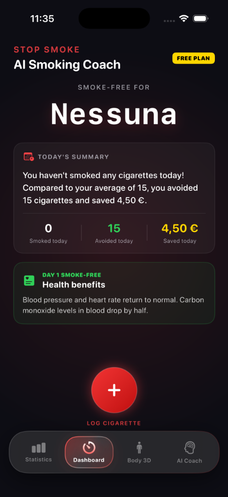
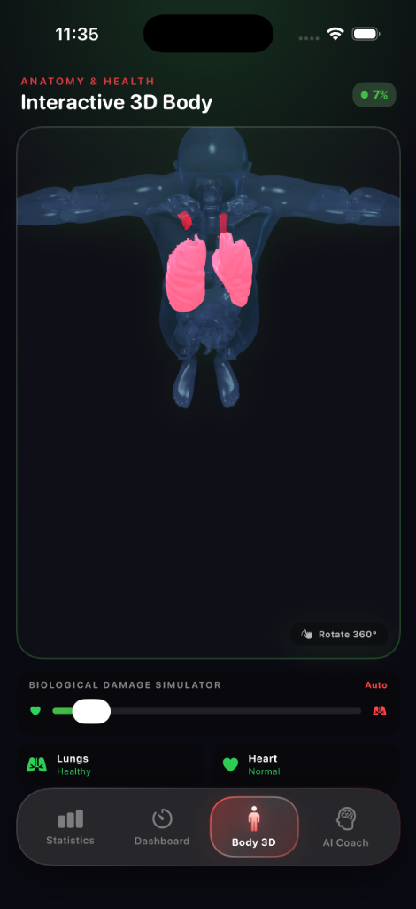
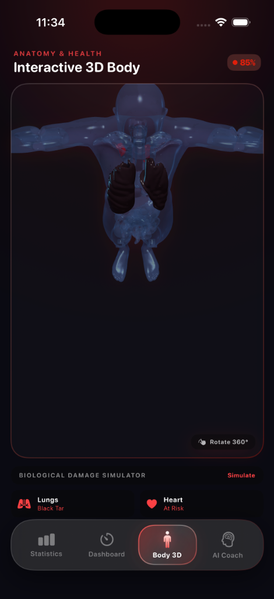
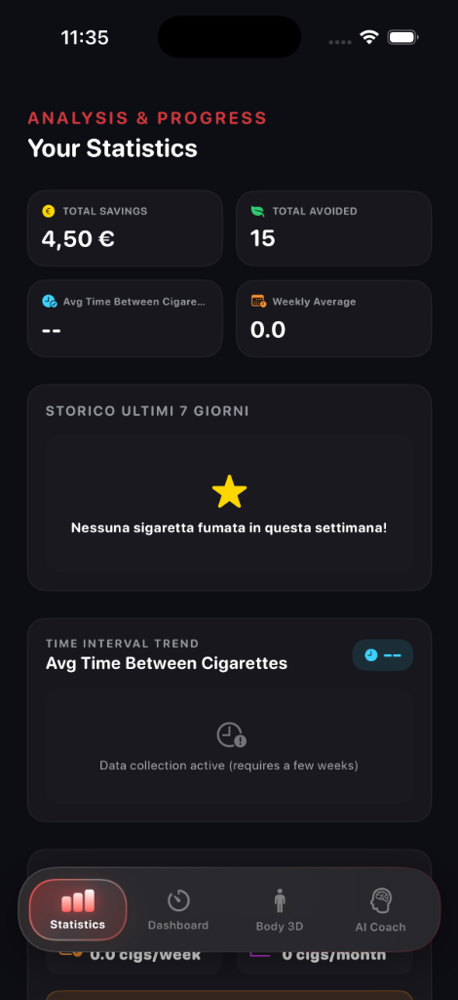
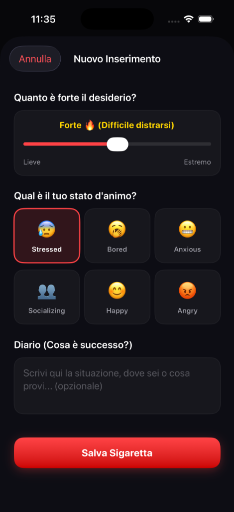

# 🚭 STOPSMOKE - iOS Anti-Smoking & Health Tracker

[](https://developer.apple.com/ios/)
[](https://swift.org)
[](https://developer.apple.com/swiftui/)
[](https://en.wikipedia.org/wiki/Model%E2%80%93view%E2%80%93viewmodel)

**STOPSMOKE** è un'applicazione iOS moderna e performante progettata per guidare e motivare gli utenti nel percorso di disassuefazione dal fumo. Combina tracciamento in tempo reale, grafici avanzati, visualizzazione 3D interattiva dell'anatomia umana e un assistente personalizzato.

---

## 📱 Screenshots

| Dashboard Principale | Visualizzazione 3D (Sana) | Visualizzazione 3D (Simulatore Danni) |
| :---: | :---: | :---: |
|  |  |  |

| Analisi & Statistiche | Registro Sigarette (Craving & Mood) |
| :---: | :---: |
|  |  |

---

## ✨ Caratteristiche Principali

### 📊 Dashboard & Monitoring
* **Tracciamento Risparmio**: Calcolo preciso dei soldi risparmiati e delle sigarette evitate.
* **Log Rapido**: Registrazione immediata delle sigarette fumate con indicazione di desiderio (craving intensity 1-5), umore e note.
* **Liquid Glass UI**: Interfaccia dinamica con effetto Glassmorphic, sfumature adattive e animazioni fluide.

### 🫀 Visualizzazione Biologica 3D Interattiva
* **Modello Anatomicamente Dettagliato**: Modello 3D interattivo (`USDX`/`SceneKit`) per osservare il ripristino della salute corporea.
* **Punti di Tracciamento Biologico**:
  * Pressione Sanguigna & Frequenza Cardiaca (20 min - 24 ore)
  * Ossigenazione & Pulizia Polmonare (48-72 ore)
  * Rigenerazione Cardiovascolare e Respiratoria a lungo termine

### 📈 Statistiche Avanzate (Swift Charts)
* **Grafici Settimanali & Mensili**: Distribuzione del consumo per giorno della settimana e trend di riduzione.
* **Confronti Storici**: Calcolo dell'intervallo medio tra le registrazioni e confronto continuo con la media iniziale dell'utente.

### 🤖 AI Smoking Coach
* **Assistente Motivazionale**: Interfaccia di chat integrata per ricevere supporto nei momenti di tentazione o forte desiderio (*craving*).
* **Consigli Personalizzati**: Suggerimenti pratici e strategie comportamentali in base alle statistiche personali.

### 🌐 Localizzazione Multilingua
* Supporto completo per **Italiano**, **Inglese** e **Francese**, gestito tramite `LocalizationManager`.

---

## 🛠️ Architettura & Stack Tecnologico

Il progetto è costruito seguendo le linee guida ufficiali Apple per uno sviluppo pulito, scalabile e manutenibile:

* **Framework UI**: SwiftUI
* **Gestione dello Stato**: Swift `@Observable` Macro (Single Source of Truth)
* **Design Pattern**: MVVM (Model-View-ViewModel) + Service Layer
* **Grafici**: Swift Charts
* **Grafica 3D**: SceneKit & USDZ 3D Model Rendering
* **Localizzazione**: Custom Reactive `LocalizationManager`

---

## 📂 Struttura del Progetto

```text
STOPSMOKE/
├── Models/
│   ├── Cigarette.swift           # Modello dati per il log della sigaretta (umore, craving, data)
│   ├── UserProfile.swift         # Abitudini dell'utente e data di inizio percorso
│   └── ChatMessage.swift         # Modello messaggi per l'AI Coach
├── ViewModels/
│   ├── DashboardViewModel.swift   # Logica della vista principale e statistiche rapide
│   ├── CoachViewModel.swift       # Gestione stato e messaggistica del Coach
│   └── LogCigaretteViewModel.swift# Logica per l'inserimento dei dati di consumo
├── Services/
│   ├── SmokingService.swift       # Single Source of Truth per la gestione dei dati
│   └── LocalizationManager.swift  # Gestore della localizzazione multilingua
├── Views/
│   ├── MainTabView.swift          # TabBar personalizzata a 3 schede (Liquid Glass)
│   ├── DashboardView.swift        # Vista principale con card dei progressi
│   ├── StatsView.swift            # Schermata statistiche e grafici completi
│   ├── AdvancedStatsChartsView.swift # Grafici avanzati con Swift Charts
│   ├── WeeklyChartView.swift      # Vista grafico settimanale
│   ├── Health3DView.swift         # Componente SceneKit per l'anatomia 3D
│   ├── CoachView.swift            # Chat UI per l'assistente motivazionale
│   ├── LogCigaretteView.swift     # Form di inserimento rapido sigaretta
│   └── CigaretteDetailSheet.swift # Dettaglio della singola registrazione
├── Assets.xcassets/               # Asset grafici, icone e colori
└── human3D.usdc                   # Modello 3D anatomico
```

---

## 💻 Requisiti di Sviluppo

* **macOS**: 14.5 (Sonoma) o superiore
* **Xcode**: 16.0 o superiore
* **iOS Target**: iOS 18.0+
* **Swift**: 6.0 / 5.10

---

## 🚀 Come Eseguire il Progetto

1. Clona la repository:
   ```bash
   git clone https://github.com/tuo-username/STOPSMOKE.git
   cd STOPSMOKE
   ```
2. Apri il progetto in Xcode:
   ```bash
   open STOPSMOKE.xcodeproj
   ```
3. Seleziona un simulatore iOS (es. iPhone 16 Pro) o un dispositivo fisico con iOS 18+.
4. Premi `Cmd + R` per compilare ed eseguire l'applicazione.

---

## 👤 Autore

**Mario Balletta**
* GitHub: [@mariodeveloper-1](https://github.com/mariodeveloper-1)
